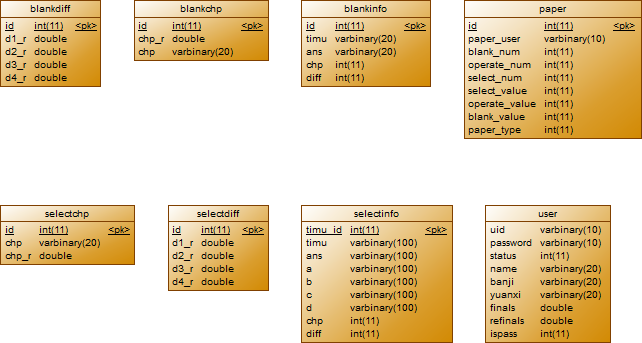

#计算机基础在线考试系统简介

##**项目背景**

这个项目是我大学的第一个真正意义上的项目，大二上的时候，找到我的任课老师，然后提前学习了Java这门课程，也是稀里糊涂的做了这个项目，今天拿出来看，
真的是烂到家了。变量名随便起，文件名命名毫无规律可言，数据库的设计属于那种，想到哪设计哪的那种。不过，大约快2个月的时间，把这个项目，慢慢的墨迹的差不多了，
写了差不多1W+行代码，纯粹是照猫画虎的那种。学习Java的过程，我觉得才是更好玩的，那种，每天早上，抱着个笔记本跑到图书馆自习室，一个人在那埋头，边看书，边写代码，
日子过的很充实.还记得，搭建tomcat环境，配置基本的xml文件，运行最简单的servlet都花费了我好几天的时间.项目，没有什么参考价值。上传到github上，就是为了留个纪念！

##**功能需求**

**For Teacher:**

* 录入、修改、删除题目
* **自动组合试卷**，以老师设置的章节比重和难易程度为参考条件
* **自动改卷，包括word,excel,ppt等操作题**
* 管理学生考试信息

**For Student:**

* 在线考试
* 成绩查询

##**整体设计**

**采用二层架构**
>显示：jsp
业务逻辑处理：javabean

##**开发工具及涉及技术**

###一、开发环境
* Windows7
* MyEclipse8.5
* Mysql5.5
* Tomcat6.0
* JDK7.0
* Chrome

###二、涉及技术
* html,css,javascript
* javabean
* jdbc
* mysql
* jacob,poi(操作题自动阅卷功能)

##**数据库设计**

###创建数据库

` create database myexam charset utf8 `

###二、ER图

###三、数据表含义

| 表名|介绍 |
| ------------- |:-------------:|
|selectinfo|选择题表，包括题目、答案、难度、对应章节、ABCD四个选项的内容|
|selectdiff|选择题的难度，简单、容易、困难、复杂|
|selectchp|选择题对应的章节，及所占比重|
|paper|试卷，及使用者、选择题、填空题、操作题的数目和分值，以及试卷类型：补考、期末考试|
|user|用户，登录名、密码、院系、班级、考试成绩等|

##Jacob&POI

word、ppt、excel的自动组卷可费了我不少劲，主要是学习jacob和poi这两个开源工具的类的使用。
并不是所有的操作都能识别，我再网上看了不少例子，自己写了一点。

附上地址：

[Jacob](https://github.com/WiseWolfs/examOnline/tree/master/JACOB)
[POI](https://github.com/WiseWolfs/examOnline/tree/master/POI)

##交流与学习

- QQ:188273928
- CSDN Blog:http://blog.csdn.net/wisewolf_life
- Email:wy_lumia@outlook.com

